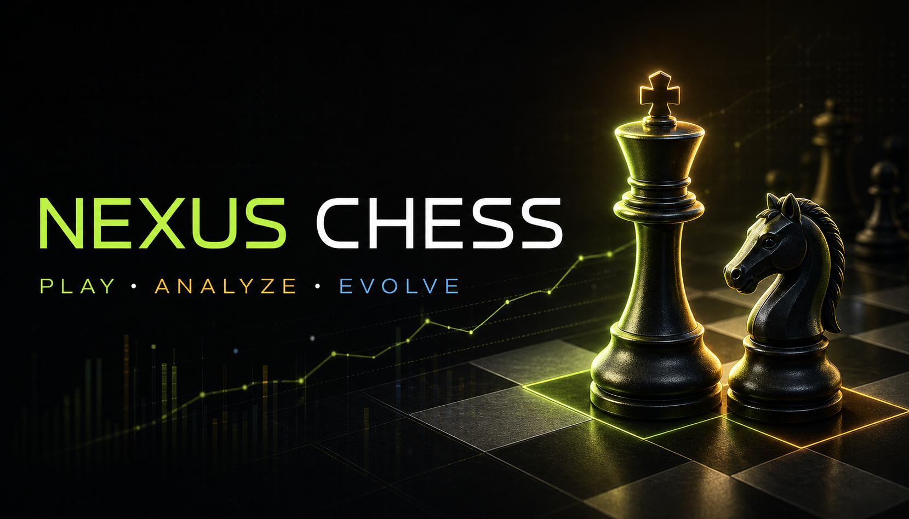

<p align="center">
  
</p>

<h1 align="center">NEXUS Chess</h1>

<p align="center">
  <strong>Play. Think. Evolve.</strong><br />
  A polished full-stack chess platform with ranked bots, real multiplayer rooms, accurate rules, clocks, ratings, and a configurable Stockfish 18 analysis lab.
</p>

<p align="center">
  <a href="https://nexus-chess-lab.novacreationsx.chatgpt.site/">Live product</a>
  ·
  <a href="./docs/ARCHITECTURE.md">Architecture</a>
  ·
  <a href="./docs/ROADMAP.md">Roadmap</a>
  ·
  <a href="./CONTRIBUTING.md">Contributing</a>
</p>

<p align="center">
  <a href="https://github.com/kushagrasaxenadev/ChessApp-Nexus/actions/workflows/ci.yml"></a>
  
  
  
</p>



## Product overview

NEXUS is designed as a serious chess product rather than a board demo. The current release combines legal over-the-board interaction, calibrated computer opponents, configurable engine analysis, authenticated profiles, durable rating data, and server-validated multiplayer rooms in one responsive interface.

### What is working

| Area | Included in v1.0 |
| --- | --- |
| Chess rules | Legal move highlighting, checks, checkmate, stalemate, repetition, fifty-move rule, insufficient material, castling, en passant, and promotion choice |
| Bot Arena | Seven distinct bot personalities across five difficulty bands, with Stockfish-limited Club, Expert, and Master play |
| Time controls | Bullet, Blitz, Rapid, and Classical presets from `1+0` through `15+10`, including increment and flag handling |
| Engine Lab | Stockfish 18 Web Worker, depth 8–24, MultiPV 1–5, hash control, skill/Elo/full-strength modes, principal variations, nodes, NPS, and FEN/line copy tools |
| Multiplayer | Private room creation/joining, server-side legal move validation, authoritative clocks, reconnectable state, PGN/FEN persistence, results, and rating updates |
| Accounts | Sign in with ChatGPT identity, player profile, rating pools, game history, and leaderboard APIs |
| Personalization | Five interface themes, six board palettes, four piece sets, side selection, responsive layout, keyboard focus, and touch feedback |
| Product shell | Branded installable web-app metadata, social sharing card, health endpoint, responsive arena, and accessible selection states |

## Brand showcase


The NEXUS identity uses a crowned `N` mark, graphite surfaces, warm ivory pieces, and an electric-lime analysis signal. Reusable files and usage guidance live in [`public/brand`](./public/brand) and [`docs/BRAND.md`](./docs/BRAND.md).

## Technology

- **Application:** Next.js 16, React 19, TypeScript, vinext, Cloudflare Workers
- **Chess domain:** `chess.js` for rules and legal state transitions
- **Engine:** Stockfish 18 WebAssembly running inside a browser Web Worker
- **Data:** Cloudflare D1 with Drizzle ORM and checked-in migrations
- **Validation:** Zod contracts, ESLint, strict TypeScript, Node test runner
- **Identity:** Sign in with ChatGPT headers supplied by the hosting platform
- **UI:** Product-owned responsive CSS, Lucide icons, Geist typography

## Quick start

### Requirements

- Node.js `>=22.13.0`
- npm

### Install and run

```bash
npm ci
npm run dev
```

Open the local URL printed by the development server. The Stockfish browser assets are prepared automatically before development and production builds.

### Verify a change

```bash
npm run check
```

This runs linting, strict type checking, the production build, and rendered-output tests. Individual commands are also available:

```bash
npm run lint
npm run typecheck
npm run build
npm run test:render
```

## Environment and data

Copy `.env.example` only when enabling optional server-side model or service integrations. Do not commit real secrets.

```bash
Copy-Item .env.example .env.local
```

The hosted app declares its logical D1 binding in `.openai/hosting.json`. Database changes belong in `db/schema.ts`; create a reviewed migration with:

```bash
npm run db:generate
```

## Repository map

```text
.
├── app/                     Next routes, metadata, manifest, API handlers, styles
├── components/              Interactive NEXUS chess product surface
├── lib/chess/               Bot, rule, engine, Stockfish, and shared contracts
├── lib/server/              Multiplayer room and rating orchestration
├── db/                      Drizzle schema and database access
├── drizzle/                 Versioned D1 migrations
├── public/brand/            Product mark, social card, and showcase artwork
├── scripts/                 Repeatable build-time asset preparation
├── tests/                   Rendered product and health-contract tests
├── docs/                    Architecture, brand system, and product roadmap
├── worker/                  Cloudflare worker entrypoint
└── .github/                 CI, ownership, issue, and pull-request workflows
```

The current single-application layout is intentional. Realtime rooms and CPU-heavy engine services should split into dedicated deployables only when scale requires them; see the [architecture notes](./docs/ARCHITECTURE.md).

## API surface

| Endpoint | Purpose |
| --- | --- |
| `GET /api/health` | Machine-readable product capability status |
| `GET /api/me` | Authenticated profile, ratings, and recent games |
| `GET /api/leaderboard` | Rating-pool leaderboard |
| `POST /api/multiplayer/rooms` | Create a server-validated room |
| `GET /api/multiplayer/rooms/:code` | Read or join a room |
| `POST /api/multiplayer/rooms/:code/move` | Submit a versioned legal move |

## Product principles

1. **Chess truth is deterministic.** Rules and engine output are structured before any coaching explanation is generated.
2. **The server owns competitive state.** Online clocks, accepted moves, results, versions, and rating updates are authoritative.
3. **Difficulty should be honest.** Bot labels map to controlled behavior or Stockfish Elo limits rather than arbitrary delays alone.
4. **Fast paths stay local.** Legal interaction and browser Stockfish remain responsive without a server round trip.
5. **Every release is reproducible.** Brand assets, migrations, tests, CI, and documentation are versioned with the source.

## Roadmap

The next major endeavors are summarized below; acceptance criteria and sequencing are maintained in [`docs/ROADMAP.md`](./docs/ROADMAP.md).

- Durable Object WebSocket rooms, quick pairing, spectators, and tournament-ready clocks
- Full post-game review with move classifications, accuracy, opening explorer, and shareable reports
- Production AI coach integration grounded exclusively in structured engine evidence
- Puzzles, lessons, clubs, friends, moderation, anti-cheat review, and notification systems
- PWA/offline hardening, mobile packaging, observability, load testing, and accessibility audits

## Git workflow

- Create focused branches from `main` using `codex/<topic>` or `feature/<topic>`.
- Keep commits small, descriptive, and independently buildable.
- Run `npm run check` before opening a pull request.
- Include screenshots for UI changes and migrations for schema changes.
- Never commit `.env` files, credentials, generated Stockfish binaries, build output, or local worker state.

See [`CONTRIBUTING.md`](./CONTRIBUTING.md), [`SECURITY.md`](./SECURITY.md), and the repository pull-request template for the complete release checklist.

## Ownership and license

Maintained by [@kushagrasaxenadev](https://github.com/kushagrasaxenadev). No open-source license has been granted yet; all rights are reserved unless a license is added to the repository.
