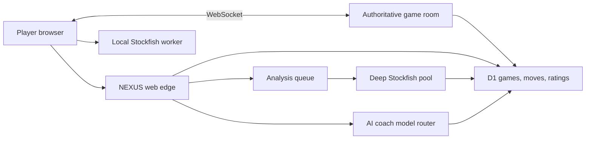

# NEXUS Chess — platform foundation

This repository is the first production-shaped slice of a Chess.com-style platform. It establishes the boundaries before filling in every feature.

## Recommended stack

| Layer | Choice now | Scale path |
| --- | --- | --- |
| Web product | Next.js 16, React 19, TypeScript, Tailwind/CSS, Lucide | Keep the UI edge-renderable and progressively stream heavier panels |
| Chess rules | `chess.js` behind product-owned game contracts | Add variant-specific rule adapters only when a variant ships |
| Live games | One authoritative room per game; WebSocket event contracts in this repo | Cloudflare Durable Objects with hibernating WebSockets |
| Durable data | Cloudflare D1 + Drizzle migrations | Enable D1 read replication; move high-volume analytics to ClickHouse/BigQuery later |
| Engine | Stockfish WebAssembly in a Web Worker for instant local analysis | A containerized Stockfish pool for deep review, queues, and anti-cheat isolation |
| AI coach | Model router behind `ChessCoach`; engine facts are always supplied to the model | Fast model for inline hints, deeper model for game review, fallback with circuit breakers |
| Files | None yet | R2 for avatars, imported PGNs, exports, and generated share cards |
| Quality | TypeScript, ESLint, Node tests, contract validation with Zod | Playwright journeys, load tests, clock-drift simulation, and engine golden tests |

The choices follow the official guidance for [Durable Object WebSocket hibernation](https://developers.cloudflare.com/durable-objects/best-practices/websockets/), [D1 read replication](https://developers.cloudflare.com/d1/best-practices/read-replication/), [chess.js move validation](https://jhlywa.github.io/chess.js/), [Stockfish WebAssembly](https://github.com/lichess-org/lila-stockfish-web), and the [OpenAI Responses API](https://platform.openai.com/docs/quickstart/make-your-first-api-request).

## Runtime shape

## Non-negotiable game rules

1. The server owns the clock, legal move validation, result, and monotonically increasing game version.
2. A client move includes the version it was based on; stale events are rejected and the authoritative state is replayed.
3. Every accepted move is appended with SAN, UCI, resulting FEN, and remaining clock time.
4. Ratings update once, transactionally, from the final result. Retries use idempotency keys.
5. AI prose never decides chess truth. Stockfish/rules output is structured first, then the coach explains it.
6. Deep analysis and anti-cheat workloads are isolated from live gameplay.

## Data already modeled

- Users and per-time-control rating pools
- Games, clocks, results, and optimistic versions
- Append-only move history
- Matchmaking tickets
- Asynchronous analysis jobs

The first migration is generated in `drizzle/`. D1 is declared as the logical `DB` binding in `.openai/hosting.json`.

## Delivery sequence

### Milestone 1 — foundation (this version)

- Product shell and responsive live-board workspace
- Fully legal local move interaction powered by `chess.js`
- Server data schema, engine/coach interfaces, realtime event contracts, health route

### Milestone 2 — real multiplayer

- Sign-in, profiles, lobby, quick pairing, private challenges
- Durable Object game rooms, reconnect/replay, draw/resign/abort flows
- Server-authoritative clocks and Glicko-2 rating updates

### Milestone 3 — engine and review

- Stockfish Web Worker with UCI parsing and MultiPV
- Deep analysis queue, per-move classifications, opening explorer
- Configurable AI coach with streaming explanations and cost controls

### Milestone 4 — platform depth

- Friends, chat, clubs, tournaments, leaderboards, lessons, puzzles
- Moderation, reports, abuse controls, observability, anti-cheat review tooling
- Mobile/PWA performance and accessibility hardening

## Suggested repository evolution

Keep this web surface as `apps/web`. Add `apps/realtime` only when Durable Object deployment starts, `apps/engine` for the containerized UCI worker, and shared packages for contracts, chess domain logic, and UI. Do not start with many independently deployed services; split only the two workloads that have genuinely different scaling profiles: realtime rooms and CPU-heavy engine analysis.
