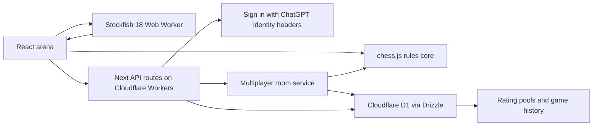

# NEXUS Chess architecture

NEXUS v1.0 is a full-stack edge application with three deliberate execution boundaries: deterministic chess state, local engine computation, and authoritative online persistence. This keeps board interaction fast while protecting competitive results.

## Runtime map

## Module boundaries

| Surface | Responsibility |
| --- | --- |
| `components/chess-studio.tsx` | Player interaction, clocks, panels, board presentation, room controls, and engine configuration |
| `lib/chess/bots.ts` | Bot identities, calibrated difficulty bands, themes, time controls, and training move selection |
| `lib/chess/engine.ts` | Product-owned engine and coaching interfaces |
| `lib/chess/stockfish-client.ts` | Worker lifecycle, UCI commands, options, analysis parsing, and cancellation |
| `lib/chess/contracts.ts` | Validated realtime and domain message contracts |
| `lib/server/online.ts` | Room creation/join, version checks, legal moves, clocks, results, persistence, and ratings |
| `app/api/**` | HTTP boundary for profile, leaderboard, health, room, and move operations |
| `db/schema.ts` | Users, ratings, games, moves, rooms, matchmaking, and analysis job records |
| `drizzle/**` | Reviewed and reproducible D1 schema migrations |
| `scripts/prepare-stockfish.mjs` | Copies version-pinned Stockfish browser assets into ignored build input |

## Chess correctness

Standard chess legality is delegated to `chess.js`; NEXUS owns product flow around it.

- Every move is applied to a known FEN and recorded with SAN, UCI, resulting FEN, and clock state.
- Promotion requires an explicit queen, rook, bishop, or knight choice.
- Checkmate, stalemate, threefold repetition, fifty-move rule, and insufficient material are distinguished.
- Castling and en passant are legal only when accepted by the rules core.
- AI text is never allowed to decide legal moves, evaluation, clocks, or results.

## Bot and engine model

Difficulty bands use two strategies:

1. Rookie and Casual use controlled training behavior with intentional variance.
2. Club, Expert, and Master request Stockfish 18 moves with depth and Elo limits.

Bot profile offsets produce distinct opponents inside a band without changing the meaning of that band. If the Stockfish worker is unavailable, the UI reports the fallback rather than silently claiming engine strength.

The analysis panel owns a separate UCI session configuration with depth, MultiPV, hash, skill, Elo, and full-strength controls. Analysis runs in a Web Worker so search does not block board interaction.

## Multiplayer authority

The server validates online moves even if the client has already highlighted them as legal.

1. A client sends its room code, move, and last-known room version.
2. The server reloads authoritative state and rejects stale versions.
3. Elapsed time is charged from server timestamps.
4. `chess.js` validates and applies the move.
5. Room state and append-only move data are persisted.
6. Terminal results and rating updates are applied once with an idempotent guard.
7. The client receives the new authoritative version and clock snapshot.

The current HTTP room flow is reconnectable and persistent. Durable Object WebSockets are the planned scale boundary for lower latency and high concurrency; they should preserve these contracts rather than duplicate game rules.

## Identity and ratings

The hosting layer supplies trusted Sign in with ChatGPT identity headers. Server helpers normalize them into product user records. Anonymous visitors receive device-local guest identity for unrated room play; authenticated users can access durable rating pools and history.

Ratings are separated by Bullet, Blitz, Rapid, and Classical pools. A finished rated room can apply a result only once.

## Data ownership

- D1 is the source of truth for accounts, ratings, games, rooms, moves, and analysis job metadata.
- Browser storage is limited to device-local preferences and guest presentation.
- Secrets remain server-only and are managed by the hosting environment.
- Generated Stockfish binaries and build output are intentionally ignored; their source package and preparation script are versioned.

## Deployment shape

vinext compiles the Next application into a Cloudflare Worker-compatible ESM bundle. The Sites project binds D1 at deployment time and publishes the exact Git commit represented by a saved version. The repository keeps hosting metadata logical and contains no platform credential.

## Scaling decisions

Keep the product in one deployable application until a workload has a different operational profile.

- Split **realtime rooms** when concurrent connections require Durable Object placement and hibernation.
- Split **deep analysis** when CPU queues, quotas, or anti-cheat isolation require containerized Stockfish workers.
- Keep shared rules, event contracts, and rating logic in versioned packages before either split.
- Add analytics storage only when product queries exceed D1's operational role.

## Quality gates

`npm run check` is the release gate: lint, strict TypeScript, production build, and rendered product/health tests. Pull requests also require UI evidence for visible changes and migrations for schema changes. Future multiplayer releases add clock-drift, stale-version, concurrency, reconnect, and duplicate-rating test matrices.
